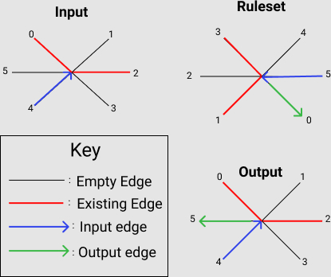

# Recreating Paterson’s Worms
# Alana Huitric and Sam Cabrera
# Abstract

We plan to investigate the patterns and behaviors of a cellular automata: Paterson’s Worms by replicating it in Python using NetworkX. In this experiment we will be extending the original program by analyzing the worm patterns generated by seeing if the length of the worms have a long-tailed distribution. Additionally, we plan to explore whether or not it is possible to get the fractal dimension of various worm patterns using a modified box counting method, in order to determine their similarity to other fractal generating cellular automata.

# Annotated Bibliography
[Paterson’s Worm](https://dspace.mit.edu/bitstream/handle/1721.1/6210/AIM-290.pdf) by Micheal Beeler:  This paper from MIT in 1973 describes the rules of the mathematical idealization of prehistoric worm trail patterns. To do this, it proposes an automation that operates on a triangular grid, with each vertex having 6 edges at which to approach. The worm automatons function by exploring new vertices, one at a time, with different rule sets resulting in different directions from interactions with vertices. It also discusses the cases that could not be computed with the technology at the time as they seemed to go on forever.

# Paterson's Worms
Paterson’s worms are a type of cellular automata that are often mentioned along with Turing machines, Langston’s Ant and turmites. This cellular automata seeks to capture the idea of an agent that has the ability of moving in 2-d beyond the cardinal directions, attempting to capture the idea of “soft” and “hard” turns, for the purpose of travelling through a triangular grid from node to node where each has six possible neighbors.

The worm’s next move is dependent on the direction of the last movement it has made and the state of the edges (previously travelled paths) of the node it has moved from. 

In the image above we have an example of the original encoding of Paterson’s worms. The entire ruleset is encoded relative to the worm’s previous move being to the left direction (we encode that as direction with an output edge of 5.) For all other cases where the input edge is not five, the ruleset is accordingly adjusted as to produce the correct output relative to that direction. This is done by “rotating” the ruleset, such that we treat the output is generated relative to the input direction.

# Experiments
The first stage of our experiment was to replicate the original Paterson’s Worms in python. We used NetworkX to create the triangular graph as described in the original paper. Though we experimented with other graphing methods, NetworkX’s built in triangular grid had all the features we needed to implement our worm behavior such as row-column indexing, the adding of edges, and being able to create an unconnected graph with pre-defined node positions. 

Once we had the foundation of our worm graphing, we were able to start working on reconstructing Paterson's worms ruleset by adapting the original rules, as mentioned in the previous section, to Networkx constraints. This stage involved more manual encoding rather than an algorithmic approach. We studied the encoding of the original paper which consisted of a few pages of diagrams listing the different possible behaviors of the worm once it arrived at a distinct node. However the diagram only showed the encoding for one direction (to the left or our ‘5’) thus we had to implement a way to ‘rotate’ the ruleset such that it could be applied in any direction. 

Now, once the worm (agent) knows which direction to move based on the encoding it will move from one node to another by drawing an edge. This is the current experiment stage, results will be seen in the next section.
Finally, our next step for this project will be moving on to the extensions. In the first we will be counting the lengths of the worms and analyzing them to see if they form a heavy-tailed distribution. As for the latter we will attempt to implement a modified box counting algorithm to see if some of the worms are actually fractals.

# Experimental Results
We will test the patterson’s worm code by running specific rulesets provided in the paper and checking that various different configurations match

For Ruleset 0423 which in the version of our encoding would be (1,1,2,0,2,0,0), the ending worm should look like this: 

Our Version: 

Some other interesting worms we found: 

"Ribbon" (0,3,2,1,2,2,0):

"Splatter" (0,2,0,2,0,1,0):

"Sword" (0,3,1,1,0,2,0):

"Flower" (0,0,2,1,1,2,0):

# Result Interpretation
The worms generated are the same as the original paper’s worms in that they generate a somewhat organic pattern. For now we have not really worked on any quantitative analysis of the worms however we have explored it qualitatively. From a more abstract point of view the visually complicated patterns that the worms generate are a result of emergent properties formed by the worm's movements being dependent on not only the previous state of the worm but the neighboring nodes states as well which makes the worm inherently dependent on all of its previous states. 
One of the methods of analysis for the worms in the paper is calculating the coefficient of *path length/number of nodes visited*. This coefficient seems to grow as the length of the worm (and somewhat the number of generations the worm lives). We can use this to further analyze how certain general types of rulesets function.

# Causes for Concern
Our main concerns going forward with this project will be translating the Networkx graph to a regular cartesian graph in order to be box counted and the time it will take to implement this before the project is due.

# Next Steps
	# Alana:
	- Looking for more ways to analyze cellular automata/implementing the box counting

	# Sam
      -	Implement node-counting and graph conversion
