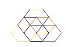
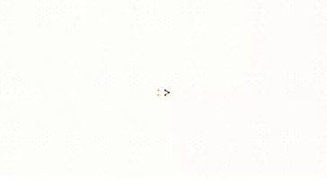
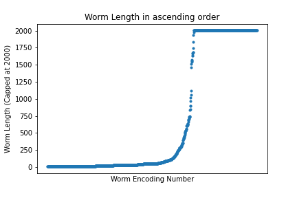
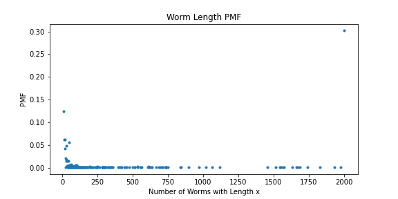
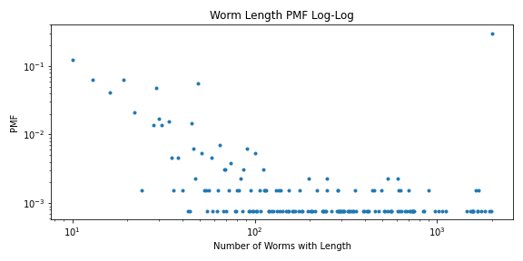
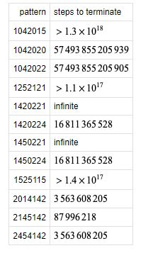

# Recreating Paterson’s Worms
# Alana Huitric and Sam Cabrera
# Abstract

This experiment seeks to investigate the patterns and behaviors of a cellular automaton, Paterson’s Worms, by replicating it in Python. We are extending the original program by analyzing the worm patterns generated by visualizing them with colors to represent the order in which the worm was generated and seeing if the length of the worms have a long-tailed distribution.

# Annotated Bibliography
[Paterson’s Worm](https://dspace.mit.edu/bitstream/handle/1721.1/6210/AIM-290.pdf) by Micheal Beeler:  This paper from MIT in 1973 describes the rules of the mathematical idealization of prehistoric worm trail patterns. To do this, it proposes an automation that operates on a triangular grid, with each vertex having 6 edges at which to approach. The worm automatons function by exploring new vertices, one at a time, with different rule sets resulting in different directions from interactions with vertices. It also discusses the cases that could not be computed with the technology at the time as they seemed to go on forever.

# Paterson's Worms
Paterson’s worms are a type of cellular automata that are often mentioned along with Turing machines, Langston’s Ant and turmites. The idealized worm is one that is able to generate beautiful and complex patterns by being programmed with a simple ruleset, inspired by the complex fossilized imprints of prehistoric sea-worm tunnels. The philosophy of the simple rule set was influenced by the feeding behavior of the prehistoric worms as a worm would not retrace the same path it traveled for it would be devoid of food but instead travelling in repeating patterns over patches where food may have occurred. Thus, when simulated, some of the patterns generated by Paterson’s worms can appear organic in nature similar to the original ancient sea-worm fossils. These patterns range in complexity from quickly terminating worms in symmetric patterns and long but simple ‘ribbon’ worms to highly complicated asymmetric worms that can get to 10^18 segments in length and there is even a worm of unknown, perhaps infinite, length.  Finding a ruleset that allows the worm to become extremely long is a challenge by itself and is even a [game](http://www.atarimania.com/game-atari-400-800-xl-xe-worms_5861.html). However one key aspect of Paterson’s worm is that it travels in 2-d beyond the cardinal directions, so that it is able to move in “soft” and “hard” turns, for the purpose of travelling through a triangular grid from node to node where each has six possible neighbors.

The worm’s next move is dependent on the direction of the last movement it has made and the state of the edges (previously travelled paths) of the node it has moved from. This behavior allows for emergent properties of the worm to form after many iterations which will be observed in the Interpretation section.

# Question

Research on Paterson’s Worms has largely declined due to the need for more processing power many decades ago and recently has mainly been independently researched by hobbyists in order to find the length of the longest worm. Thus in this experiment we seek to learn more about the less investigated distribution of worm lengths. The question we seek to answer is if the length of worms form a long tailed distribution for worms under a length of 1500. The reason we impose a limit is due to the fact one of the worms is known to be 10^18 segments in length as well as another worm being of unknown infinite length and simulating all of the worms even up to a million segments requires more processing power than we have. 

In the image above we have an example of the original encoding of Paterson’s worms. The entire ruleset is encoded relative to the worm’s previous move being to the left direction (we encode that as direction with an output edge of 5.) For all other cases where the input edge is not five, the ruleset is accordingly adjusted as to produce the correct output relative to that direction. This is done by “rotating” the ruleset, such that we treat the output is generated relative to the input direction.

*Figure 1. A diagram of an example worm input/ruleset/output behavior.*

# Experiment Methodology
Paterson’s Worms requires a triangular grid as seen below, in order to create ‘hard’ and ‘soft’ turns for the worm-agent to travel through. NetworkX has a built-in triangular grid graph which is perfect for simulating the head and body of the worm in space by adding edges to the graph that represent segments of the worm.

*Figure 2. Triangular grid that Paterson’s worm travels through, replicated by a triangular grid NetworkX graph in this experiment.*

The worm itself behaves according to a directionally influenced ruleset, an example of which from the original paper by Beeler is provided below. The original paper only gives the ruleset for the worm moving horizontally to the left and what is not explicitly given in the paper is that this ruleset is rotated for the current direction the worm is approaching a new node from. Thus we implemented this rotation by manually encoding a ‘rotation’ of a left facing ruleset to match the incoming direction of the worm. 

*Figure 3. Paterson’s Worms ruleset from source 1 for the left direction.*

Below is an example of the manual encoding process of the worm. For context, we assigned each of the six possible neighbors of a node a direction number from 0 to 5 with 0 being the top left neighbor and the numbers increasing clockwise.

*Figure 4. Implemented ruleset rotation process.*

With a ruleset that can be applied in any of the six directions, the worm is able to traverse from one node on the NetworkX graph to another by drawing an edge. When a worm is displayed using the default NetworkX drawing settings after a predetermined number of steps or its end state it comes out in a black and white grid that only shows the final pattern of the worm. While the general emergent pattern of the worm can be seen in this state, how the worm created the pattern is much less apparent. Thus we briefly explored the visualization of worms and implemented an animation method as well as a coloring of the worm that colors ‘older’ segments of the worm darker and nodes with more neighbors darker as well.

We implemented the extension by creating a script that ran all of the possible worm rulesets with a length cap to reduce processing time and power needed as NetworkX graphs with more than a million nodes were too difficult to run with our available time and RAM. We recognize that placing a cap on the total length of the worms will definitely eliminate some of the worms that would be on the end of the worm length distribution such as the worm with length of 10^18 or unknown, infinite length, but they would also be unrealistic for us to run to completion. However we sought to find if a long tailed distribution would form even at the shorter worm lengths and thus ran our script with a cap length of 2000 segments.

# Results

To test if our implementation of Paterson’s worms works the same as the original, we run ours with specific rulesets provided in the paper and checking if our outputs match.
For Ruleset 0423 which in the version of our encoding would be (1,1,2,0,2,0,0), the ending worm should look like this: 

Our Version: 

Some other interesting worms we found: 

"Spiral" (0,2,0,2,0,1,0):

"Sword" (0,3,1,1,0,2,0):

"Flower" (0,0,2,1,1,2,0):

To analyze the worm length, we calculated every possible worm combination in an 1000x1000 grid, running for 2000 steps. Though there are worms several orders of magnitude larger than the max possible length of 2000 in this configuration, we were not able to further compute larger worms without crashing the program. This is due to a combination of inefficiencies in the code, access to hardware, and the speed of the python language. 

*Figure 5. Plot the worm lengths over the corresponding encoding numbers, x-ticks removed for clarity.*

To further look at this truncated data we also plotted the pmf of worm lenghts on both a regular and log-log axis: 

*Figure 6. PMF plot of worm lengths.*

*Figure 7. PMF plot of worm lenths in log-log axis.*

# Result Interpretation

The worms generated are the same as the original paper’s worms in that they generate a somewhat organic pattern. Qualitatively for the same rulesets, they produce the exact same worms as the original paper’s, thus our replication was successful. Additionally, with the color changing and animation visualization we were able to see that some of the worms were able to do some strange behavior such as passing through parts of themselves in an asymmetric manner yet still manage to live for quite a while such as a ‘splatter’ pattern. To go further into our analysis, from a more abstract point of view the visually complicated patterns that the worms generate are a result of emergent properties formed by the worm's movements being dependent on not only the previous state of the worm but the neighboring nodes states as well which makes the worm inherently dependent on all of its previous states. This is characteristic of a complex system and thus analyzing the distributions of a quantitative value of our simulation was our next step.

Taking a look at the above worm length over worm number graph, reveals the resitriciton of step number only enables us to dissect the the shorter end of the worm lengths, which account for around 70% of the total worms. The plot is promising in shape, behaving similar to an exponential function before the 2000 cap. Despite this, because the tail end of the dataset is not included, we cannot predict what the rest of the curve would look like and if would display heavy-tailed behavior. 

Further studying the pmf graphs we run into this issue again, but this time the part of the graph we can see is does not reveal a lot about how the worm length pmf's shape or general distribution. This might be since pmfs work better in loglog graphs, where large differences in orders of magnitude are better displayed, and we only have access to the short worms.

Despite our inability to further calculate longer worms, others have been able to look into a few of the known finite worms of higher magnitude lengths, this chart from [Wolfram](https://mathworld.wolfram.com/PatersonsWorms.html) shows a few of them:

Though this slice of the nearly 300 worms missing does not tell us much conclusively about the distribution being heavy-tailed, it does demonstrate the large range of magnitude the worm lengths can be. This is encouraging to the possibility of the distribution being long-tailed as these tail points have such variable orders of magnitude.

One of the methods of analysis for the worms in the paper is calculating the coefficient of *path length/number of nodes visited*. This coefficient seems to grow as the length of the worm (and somewhat the number of generations the worm lives). We can use this to further analyze how certain general types of rulesets function.

# Next Steps

Future extensions of this project could explore the more qualitative aspects of the generated worms. Originally we were planning to find the various fractal dimensions of different worms but due to processing times and Networkx to cartesian conversion,  we were not able to complete this part of the extension. However our hypothesis is that there will definitely be some non fractal worms such as the ribbons, but there will also likely be fractal worms that are able to repeat their patterns for a very long time without dying. Some of the more interesting worms to explore would be the asymmetric worms that are able to cross through themselves yet due to their rule sets are able to start looping on their outside again and continue to live. 

Annotated Bibliography
1. [Paterson’s Worm](https://dspace.mit.edu/bitstream/handle/1721.1/6210/AIM-290.pdf) by Micheal Beeler:  This paper from MIT in 1973 describes the rules of the mathematical idealization of prehistoric worm trail patterns. To do this, it proposes an automation that operates on a triangular grid, with each vertex having 6 edges at which to approach. The worm automatons function by exploring new vertices, one at a time, with different rule sets resulting in different directions from interactions with vertices. It also discusses the cases that could not be computed with the technology at the time as they seemed to go on forever.
2. [Knotted Doughnuts](https://bobson.ludost.net/copycrime/mgardner/gardner11.pdf) by Martin Gardner: This book is a collection of various Scientific American columns. Chapter Seventeen: “Worm Paths” Discusses various implementations of worms (moving points) that can generate different geometric shapes and patterns, including Paterson’s Worms and other similar worm implementations. The article also discusses Frank C. Odds’  spirolaterals which are a class of rules that are applied to worms but the worms only turn at increasing intervals which create symmetric patterns that can be described by an equation.
